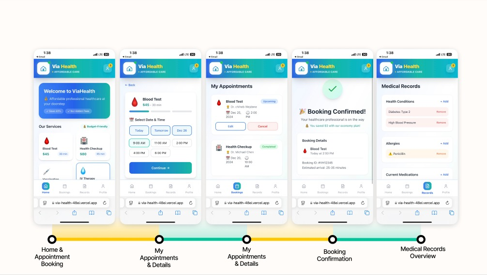

# 💉 Via-Health

[🌐 Live Demo](https://via-health-48ei.vercel.app/)

---

## 📖 About the Project
**Via-Health** is a React-based web application created as part of my **Economy Project** 💼.  
It focuses on **healthcare at home** 🏥, allowing users to track, visualize, and manage medical-related data easily.  

This is just the **frontend version** for now ⚡, and I'm actively looking to **develop it further** with a backend, more features, and better UX/UI 🎨.  

---

## ✨ Features
- 📝 **Data Tracking:** Log medical/home health data easily  
- 📊 **Visualizations:** See charts/stats of your health info  
- ⚡ **Fast & Responsive:** Built with React for smooth performance  
- 🎯 **Scalable:** Designed to expand with backend and more advanced features  

---

## 🖼 Demo / Screenshots
See it live here: [https://via-health-48ei.vercel.app/](https://via-health-48ei.vercel.app/)  

Screenshots :


---

## 🛠 Technologies Used
- ⚛️ **React**  
- 🎨 **CSS / Tailwind (if used)**   
- 🧰 **Other Tools:** npm, Vercel for deployment  

---

## 🚀 Getting Started (Run Locally)
```bash
# 1️⃣ Clone the repo
git clone https://github.com/itsmeisraa/your-repo-name.git
cd your-repo-name

# 2️⃣ Install dependencies
npm install
# or
yarn install

# 3️⃣ Run the app
npm start
# or
yarn start

# 4️⃣ Open in browser
# Visit http://localhost:3000
